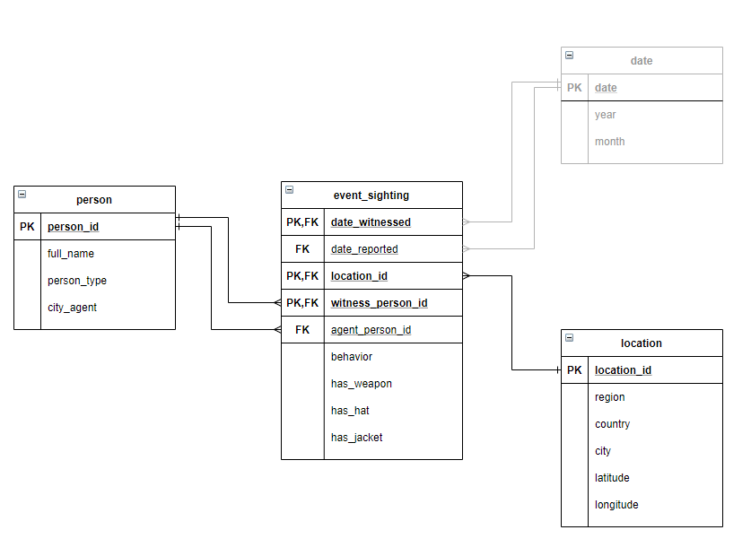
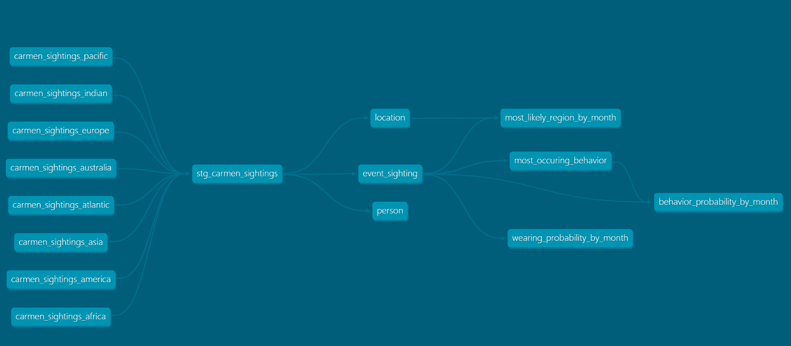
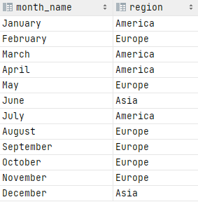
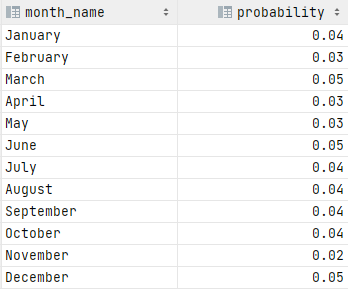
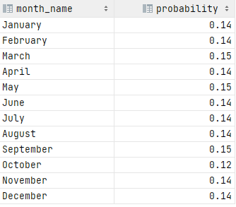

## Task description
Task description can be found [here](docs/README.md)

## Solution
### Notes and Assumptions
- Agents with the same name but different HQ: are they the same persons who were relocated or they are all different persons?
For simplicity, I assume they are different persons
- Assume that agent works only in one region and can report only to this region HQ
- Not clear what we'll have in data and how to process cases if, for example, two witnesses saw same Carmen 
  at the same day independently. What if they saw different appearances the same day? From data for simplicity assume that 
  not more than one event happens on specified date 

### ERD Diagram

- Date dimension is not implemented as it's not required for requested analytics
- I had a doubts where to put `city_agent` field but at the end decided to add it to `person` table as it is an attribute 
  of agent
- Editable version of diagram is available in `docs/ERD` folder (drawio format)




### Local installation
- Install python >= 3.8, create virtual environment outside of repository and activate it in terminal
- Install requirements: `pip install -r requirements.txt`
- Install Docker for your OS: https://docs.docker.com/get-docker/
- Run Postgres in a container: `docker run --name carmen-db-container -e POSTGRES_USER=your_username -e POSTGRES_PASSWORD=your_password -p 5432:5432`
  This will create and run a container `carmen_db_container` with specified root user and password
- Create a database `name_of_your_db`
- Create environment variables:
```
    POSTGRES_DB=<name_of_your_db>
    POSTGRES_USER=<your_username>
    POSTGRES_PASSWORD=<your_password>
```
- dbt project is located in `where_is_carmen` folder. Sub-folder `profiles` contains example file for profiles.yml.
  
    If you use Postgres, copy this file into `~/.dbt/` and rename to `profiles.yml`: https://docs.getdbt.com/dbt-cli/configure-your-profile#advanced-customizing-a-profile-directory.
  
  Change folder in terminal to project folder `where_is_carmen` (`cd where_is_carmen`) and run `dbt_deps` to install dbt packages
- Execute `dbt seed`, `dbt run` and then `dbt test` to run and test the whole pipeline 


### Implementation
- Python script `./utils/convert_xlsx_to_csv.py` is developed to convert Excel file into CSV. I added new column region
  which is populated by sheet name
- Description of second step mentions creating of eight view models on top of csv files. I decided to upload files using 
standard functionality of dbt - `dbt seed`. Then I created one staging view `stg_carmen_sightings`. The reasons of such decision:
  - although dbt is tool for transformation and it is not supposed to do regular file loads in database, it could be used for one time load
  - probably I could use `COPY FROM` statement or create external table in macro to load CSVs but it makes the process more 
    complex and less repeatable in other databases
  - using one staging view makes process simpler and it allows to test/validate the whole dataset before we start loading data to 
    the next schema
- Indexes are not created intentionally, as size of tables is very small
- Further possible improvements: 
  - currently python script for csv conversion should be executed separately. 
Could use fal package to place python script into pre-hooks: https://github.com/fal-ai/fal
  - sh runner script to make presentation easier? Containerize development environment?
  - deploy dbt docs as static site in cloud bucket for nice presentation of the whole graph.
    
    :white_check_mark: **Click here**: http://where-is-carmen-dbt-docs.s3-website-ap-southeast-2.amazonaws.com/index.html#!/overview
    


### Analytics
1. Q: For each month, which agency region is Carmen Sandiego most likely to be found?
   
   A:
   
    
   

2. Q: Also for each month, what is the probability that Ms. Sandiego is armed AND wearing a jacket, but NOT a hat? 
   What general observations about Ms. Sandiego can you make from this?
   
    A:

    
   
    Observations (looking at all attributes - has_weapon, has_jacket and has_hat): hat is not that important, 
   usually Carmen wears her red coat and usually she has no weapon


3. Q: What are the three most occuring behaviors of Ms. Sandiego?   
   Not clear what to do if we have a tie in third place. I take first in alphabetical order (but for real tasks I would 
   prefer to use rank function to have all rows)
   
    A: Three most likely behaviors: Out-of-control, Complaining, Happy
   


4. Q: For each month, what is the probability Ms. Sandiego exhibits one of her three most occurring behaviors?
   
   A:
   
    